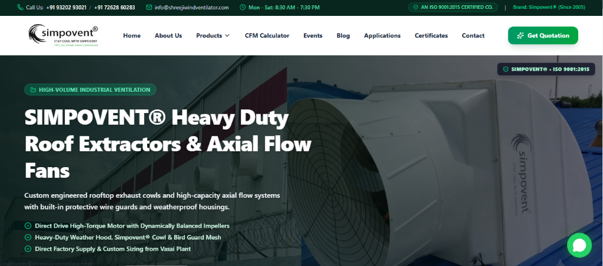
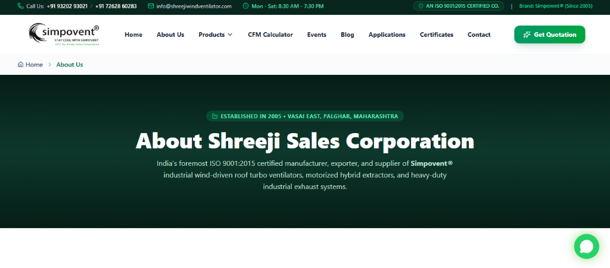
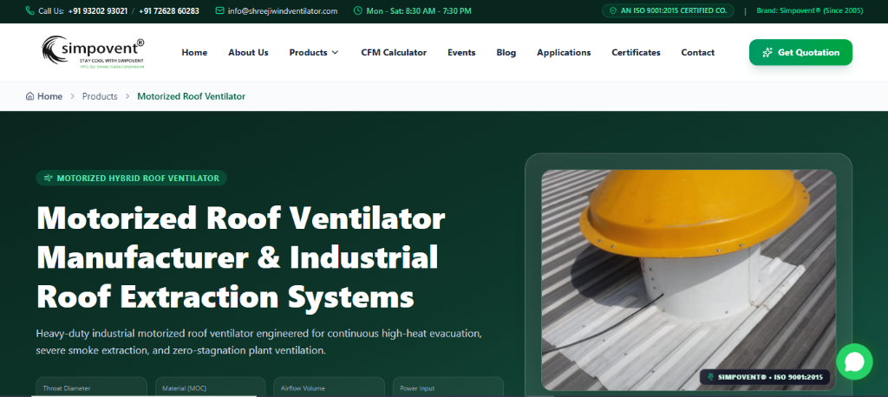
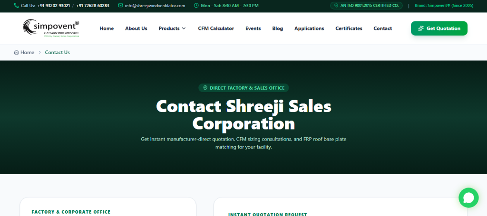

<table width="100%">
  <tr>
    <td width="50%" align="center">
      
      <p align="center"><strong>Homepage Hero & Navigation</strong></p>
    </td>
    <td width="50%" align="center">
      
      <p align="center"><strong>About Us & Manufacturing Profile</strong></p>
    </td>
  </tr>
  <tr>
    <td width="50%" align="center">
      
      <p align="center"><strong>Keyword-Optimized Product Detail</strong></p>
    </td>
    <td width="50%" align="center">
      
      <p align="center"><strong>Contact Us & RFQ Lead Generation</strong></p>
    </td>
  </tr>
</table>

# Shreeji Sales Corporation — SIMPOVENT® Web Platform

> Official B2B digital catalog, interactive ventilation sizing platform, lead generation engine, and admin CMS for **Shreeji Sales Corporation** (Brand: **Simpovent®**). Established in 2005 in Vasai (East), Palghar, Maharashtra, Shreeji Sales Corporation is an **ISO 9001:2015 certified** manufacturer, exporter, and supplier of industrial wind-driven turbo roof ventilators, motorized hybrid extractors, and heavy-duty ventilation systems.

---

## 📌 Table of Contents
1. [Project Overview](#-project-overview)
2. [Tech Stack](#-tech-stack)
3. [Folder & Directory Structure](#-folder--directory-structure)
4. [Frontend Architecture & Features](#-frontend-architecture--features)
5. [Backend Architecture & Lead Engine](#-backend-architecture--lead-engine)
6. [Comprehensive SEO Implementation](#-comprehensive-seo-implementation)
7. [Admin Portal & Content Management](#-admin-portal--content-management)
8. [Setup & Running Instructions](#-setup--running-instructions)

---

## 🚀 Project Overview

The **SIMPOVENT®** platform is an enterprise-grade B2B web application engineered to drive high-intent commercial inquiries and rank top across national and regional search results for industrial ventilation searches.

- **Brand**: Simpovent® (Since 2005)
- **Certification**: AN ISO 9001:2015 CERTIFIED COMPANY
- **Location**: Takdir Industrial Estate, Vasai East, Palghar, Maharashtra, India
- **Core Offerings**: 21" & 24" Wind-Driven Turbo Ventilators, Motorized Roof Extractors, Axial Flow Fans, HVLS Fans, and FRP Base Plates.

---

## 🛠 Tech Stack

| Domain | Technologies | Purpose |
| :--- | :--- | :--- |
| **Frontend Framework** | **Next.js 15.2.1 (App Router)** | Server Components, SSG, Dynamic Routes, Fast Refresh |
| **UI Library** | **React 19.2.8** | Component architecture & client interactivity |
| **Styling** | **Tailwind CSS v4** & PostCSS | Zero-runtime CSS styling and responsive layout design |
| **Icons** | **Lucide React** (v1.35.0) | High-performance SVG icons |
| **Backend Microservice** | **Express.js 5.2.1** (Node.js) | Standalone API server for health checks & email dispatch |
| **Email Dispatcher** | **Nodemailer 9.0.6** | Automated 3-way responsive HTML notification emails |
| **Data Persistence** | **JSON Flat-File Store** (`src/data/store/`) | Lightweight persistent database for blogs, leads & settings |
| **Process Runner** | **Concurrently 10.0.5** | Runs Next.js frontend and Express backend concurrently |
| **Language** | **TypeScript 5** | End-to-end type safety |

---

## 📂 Folder & Directory Structure

```text
shreeji-ventilator-main/
├── backend/
│   └── server.js                      # Express 5 backend server (health & 3-way mailer)
├── public/
│   ├── favicon.ico / favicon.png      # Brand favicons & touch icons
│   └── images/
│       ├── awards/                    # Industry award photos & certs
│       ├── clients/                   # Client company logos
│       ├── events/                    # Exhibition & trade fair photos
│       ├── factory/                   # Vasai manufacturing machinery photos
│       ├── office/                    # Corporate office & reception photos
│       └── products/                  # High-res ventilator product images
├── screenshots/                       # Visual showcases for documentation
│   ├── homepage-hero.png
│   ├── about-us.png
│   ├── product-detail.png
│   └── contact-us.png
├── src/
│   ├── app/                           # Next.js 15 App Router
│   │   ├── [slug]/                    # 22 Root-level keyword product routes
│   │   ├── about/                     # About Us & Vasai plant profile
│   │   ├── admin/                     # Secure Admin CMS & CRM portal
│   │   │   ├── blog/                  # Blog manager, new & edit views
│   │   │   ├── dashboard/             # Inbound lead metrics & quick actions
│   │   │   ├── leads/                 # Inquiry tracking & status manager
│   │   │   └── settings/              # Contact info & SMTP credentials
│   │   ├── api/                       # Next.js serverless API routes
│   │   │   ├── admin/                 # Admin auth, blogs, leads & settings
│   │   │   └── inquiry/               # Lead capture & 3-way email handler
│   │   ├── applications/              # Industry application showcase
│   │   ├── blog/                      # Knowledge hub & [slug] article reader
│   │   ├── calculator/                # Dedicated CFM & air change calculator
│   │   ├── certificate/               # ISO 9001:2015 quality credentials
│   │   ├── contact/                   # Contact details & interactive RFQ form
│   │   ├── events/                    # Manufacturing trade fair galleries
│   │   ├── privacy-policy/            # Standard compliance privacy policy
│   │   ├── products/                  # Product catalog index & [slug] alias
│   │   ├── globals.css                # Tailwind CSS v4 directives
│   │   ├── layout.tsx                 # Root layout with Organization JSON-LD
│   │   ├── not-found.tsx              # Custom 404 page with navigation fallbacks
│   │   ├── page.tsx                   # Homepage (13 modular sections)
│   │   ├── robots.ts                  # Dynamic robots.txt generator
│   │   └── sitemap.ts                 # Dynamic XML sitemap generator
│   ├── components/
│   │   ├── common/                    # Reusable components (QuoteButton, JsonLd, Modal, WhatsApp, etc.)
│   │   ├── home/                      # 13 Homepage modular sections (Hero, Specs, Calculator, FAQs)
│   │   ├── layout/                    # Header, Footer, MegaMenu, MobileNav
│   │   └── product/                   # ProductDetailHero, ProductSpecs, RelatedProducts
│   ├── data/
│   │   ├── citiesData.ts              # 15+ Target industrial cities and industrial estates (MIDC/GIDC)
│   │   ├── companyData.ts             # Central corporate info, contact numbers, geo coordinates
│   │   ├── faqsData.ts                # Technical ventilation FAQs
│   │   ├── productsData.ts            # Detailed specifications for 22 products
│   │   ├── testimonialsData.ts        # Verified client reviews
│   │   └── store/                     # Persistent JSON storage
│   │       ├── blogs.json             # Stored articles & SEO metadata
│   │       ├── leads.json             # Customer quotation requests
│   │       └── settings.json          # System settings & SMTP credentials
│   └── lib/
│       ├── db.ts                      # JSON file CRUD operations helper
│       ├── seo.ts                     # Schema.org JSON-LD generators & metadata builder
│       └── utils.ts                   # Class name merger (clsx + tailwind-merge)
├── .env.example                       # Sample environment variables
├── next.config.mjs                    # Next.js configuration & 50+ 301 redirects
├── package.json                       # Dependencies and execution scripts
└── tsconfig.json                      # TypeScript configuration
```

---

## 💻 Frontend Architecture & Features

### 1. Conversion-Driven Homepage (`/`)
Built with 13 modular sections arranged for user trust and inquiry conversion:
- **Hero Slider**: Highlighting Simpovent® industrial exhaust fans, heavy-duty extractors, and wind-driven units with direct RFQ CTAs.
- **Feature Cards**: Zero-power operation, weatherproofing, 10-year warranty, and ISO 9001:2015 certification.
- **About Intro & Factory Tour**: Highlighting 20+ years of engineering and 100,000+ installations nationwide.
- **Embedded Video Showcase**: Award ceremonies and factory machinery operation.
- **Interactive CFM Sizing Calculator**: Instant shed air volume and ventilator count estimation.
- **Technical Specifications Comparison**: Side-by-side comparison between natural wind ventilators and motorized units.
- **Industrial Applications Matrix**: PEB sheds, foundries, warehouses, pharmaceutical plants, and textile mills.
- **Client Logos & Testimonials**: Proven track record across major industrial houses.
- **Collapsible FAQ Accordion**: Direct answers to common MEP and procurement queries.

### 2. 22 Keyword-Targeted Product Pages (`/[slug]`)
Every single product in the catalog is rendered via dynamic server-rendered pages (`[slug]`) with:
- Dedicated **H1 page title** and keyword-rich subtitle.
- Technical specifications table (Throat Diameter, Outer Diameter, Vane Material, Bearing Make, MOC, Airflow CFM).
- Working principle and Return On Investment (ROI) benefits.
- Real site installation and factory photo gallery with brand watermarking.
- Embedded CFM sizing calculator on every product page to maximize dwell time.
- Contextual related products and product-specific FAQ schema.

### 3. Interactive CFM Calculator (`/calculator`)
An interactive engineering tool that calculates:
$$\text{Air Volume (cu. ft.)} = \text{Length} \times \text{Width} \times \text{Height}$$
$$\text{Total CFM Required} = \frac{\text{Air Volume} \times \text{ACPH}}{60}$$
$$\text{Ventilator Units Required} = \left\lceil \frac{\text{Total CFM Required}}{\text{CFM per Unit (1900 or 2400)}} \right\rceil$$
Supports preset Air Changes Per Hour (ACPH) for general engineering (15), warehouses (10), foundries (30), boiler rooms (25), chemical units (20), and textile mills (18).

---

## ⚙️ Backend Architecture & Lead Engine

### 1. Dual-Layer Backend
The application features a flexible dual-layer backend:
- **Next.js Serverless Route**: `src/app/api/inquiry/route.ts` handles inquiries directly within the Next.js runtime.
- **Standalone Express Microservice**: `backend/server.js` provides dedicated API endpoints (`/api/health`, `/api/inquiry`, `/api/contact`) with CORS enabled for independent deployments.

### 2. Automated 3-Way Email Notification Pipeline
Whenever an inquiry or quote request is submitted:
1. **To Factory / Client** (`info@shreejiwind.com`, `info@shreejiwindventilator.com`): Instant lead notification containing the customer's name, phone, email, city, product interest, shed dimensions, and requirements.
2. **To Customer**: A formatted confirmation receipt thanking them for contacting Shreeji Sales Corporation with instant WhatsApp and direct phone contact links to senior engineers.
3. **To Internal Admin** (`princekumarjha80@gmail.com`): Real-time alert to ensure zero lead drop-off.

### 3. Zero-Database-Overhead JSON Store
Inbound inquiries, blog articles, and site configurations are safely persisted into structured JSON files inside `src/data/store/`:
- `leads.json`: Inbound leads with tracking status (`new`, `contacted`, `quoted`, `closed`).
- `blogs.json`: Published and draft technical articles.
- `settings.json`: Site-wide telephone numbers, email recipients, and SMTP credentials.

---

## 🔍 Comprehensive SEO Implementation

The platform has been audited for complete search engine optimization across technical, structural, and content layers:

### 1. On-Page Technical SEO & Canonicalization
- **Metadata Builder (`src/lib/seo.ts`)**: Generates dynamic titles, meta descriptions, authors, Open Graph (`og:image`, `og:title`, `og:type`), Twitter Card (`summary_large_image`), and explicit canonical URLs for every route to eliminate duplicate content penalties.
- **Robots Directives**: `robots.ts` allows full crawling of all public routes while disallowing sensitive administrative and API directories (`/admin/`, `/api/`). Includes advanced Googlebot directives: `max-image-preview: large`, `max-snippet: -1`, and `max-video-preview: -1`.
- **Automated XML Sitemap (`sitemap.ts`)**: Dynamically indexes:
  - 9 Core static pages (Priority 1.0 to 0.75)
  - 22 Individual keyword product pages (Priority 0.95, weekly change frequency)
  - All published blog articles (Priority 0.85, weekly change frequency)

### 2. Legacy 301 Permanent Redirects (`next.config.mjs`)
Over 50 permanent (301) redirects are configured to preserve existing backlinks and Google index rankings from the legacy website:
- Variations of home (`/index.php`, `/home.html`, etc.) $\rightarrow$ `/`
- Legacy PHP pages (`/aboutus.php`, `/contact.php`, `/certificate.php`) $\rightarrow$ Clean Next.js paths
- Legacy product extensions (`/motorised-roof-ventilator.php` $\rightarrow$ `/motorised-roof-ventilator`)
- Legacy catalog & brochure PDF paths $\rightarrow$ `/products`
- Legacy category prefixes (`/products/:slug` $\rightarrow$ `/:slug`)

### 3. Rich Schema.org Structured Data (JSON-LD)
All structured data is generated via TypeScript utilities in `src/lib/seo.ts` and injected into the `<head>`:
- **`Organization` Schema**: Legal name, brand alias (*Simpovent*), founding date (*2005*), logo, social profiles, and multilingual customer support contact point.
- **`LocalBusiness` Schema**: Factory address in Vasai East, Palghar, exact GPS coordinates (`19.3942109, 72.8611753`), opening hours, and phone numbers.
- **`Product` Schema**: Configured on all 22 product pages with SKU, Brand, Manufacturer, price currency (INR), availability (`InStock`), and `AggregateRating` (Rating: 4.9, Review count: 148).
- **`FAQPage` Schema**: Embedded on homepage and product pages for Google Rich Snippets FAQ dropdowns.
- **`BreadcrumbList` Schema**: Hierarchical trail on all inner pages.
- **`BlogPosting` Schema**: Headline, author, publisher, datePublished, and dateModified on blog articles.

### 4. High-Intent Keyword Targeting
All 22 products are mapped to root-level clean slugs representing top commercial search queries:
- `motorised-roof-ventilator`
- `turbo-ventilator`
- `heavy-duty-industrial-exhaust-fan`
- `roof-air-ventilator`
- `wind-driven-ventilator`
- `powerless-ventilator`
- `natural-air-ventilator`
- `hvls-fan`
- `roof-extractor`
- `turbine-ventilator`
*(And 12 additional specialized variants)*

### 5. Local & Regional SEO Coverage
The codebase includes structured geographical targeting across Maharashtra, Gujarat, Rajasthan, and major Indian industrial belts via `src/data/citiesData.ts`, directly targeting MIDC and GIDC industrial estates (Chakan, Bhosari, Vatva, Naroda, Sachin, Makarpura, Peenya, Sriperumbudur, etc.).

---

## 🛡️ Admin Portal & Content Management

The platform includes a protected admin dashboard accessible at `/admin`:
- **Dashboard (`/admin/dashboard`)**: Inbound quotation statistics, latest leads, and quick management links.
- **Leads Manager (`/admin/leads`)**: Review customer submissions, inspect shed requirements, and update status (`new` $\rightarrow$ `contacted` $\rightarrow$ `quoted` $\rightarrow$ `closed`).
- **Blog CMS (`/admin/blog`, `/admin/blog/new`, `/admin/blog/edit/[id]`)**: Full CRUD editor for technical guides with custom meta titles, descriptions, focus keywords, tags, and publishing toggles.
- **Site Settings (`/admin/settings`)**: Update factory contact numbers, sales email addresses, announcement banners, and live SMTP configuration.

---

## 🚀 Setup & Running Instructions

### Prerequisites
- **Node.js**: v18.18.0 or higher (v20+ recommended)
- **npm**: v9+ or **yarn** / **pnpm**

### 1. Environment Configuration
Copy the sample environment file and configure your credentials:
```bash
cp .env.example .env.local
```
Key variables:
```env
PORT=3005
BACKEND_PORT=5000
SMTP_HOST=smtp.gmail.com
SMTP_PORT=587
SMTP_USER=your-email@gmail.com
SMTP_PASS=your-app-password
ADMIN_ALERT_EMAIL=princekumarjha80@gmail.com
CLIENT_ALERT_EMAIL=info@shreejiwind.com
ADMIN_PASSWORD=shreeji@2025
```

### 2. Install Dependencies
```bash
npm install
```

### 3. Run Development Server
To run both the Next.js frontend and Express backend concurrently:
```bash
npm run dev:all
```
* Or run Next.js alone: `npm run dev`
* Or run Express backend alone: `npm run server`

### 4. Build for Production
```bash
npm run build
```

### 5. Start Production Server
```bash
npm run start:all
```
Open **[http://localhost:3005](http://localhost:3005)** in your browser.

---

## 📞 Corporate Contact Information

- **Company**: Shreeji Sales Corporation
- **Brand**: Simpovent®
- **Head Office / Works**: Ground Flr, Building No-1, Gala No:- 11, Takdir Industrial Estate, Vasai East, Opposite Fiza Restaurant, Vasai Virar, Palghar, Maharashtra - 401208, India
- **Phone**: +91 93202 93021 / +91 72628 60283
- **Email**: [info@shreejiwindventilator.com](mailto:info@shreejiwindventilator.com) | [sales@shreejiwindventilator.com](mailto:sales@shreejiwindventilator.com)
- **Website**: [https://shreejiwindventilator.com](https://shreejiwindventilator.com)

---

## 📄 License

This repository is primarily a portfolio and demonstration project.

If this repository is later distributed as open source, add the appropriate license and usage terms.

---

## 👨‍💻 Developer

**Soham Aeer**

Full Stack Developer · React · Node.js · Express · MERN · DevOps / VPS Deployment

- Portfolio: https://soham-aeer-fullstack-portfolio.web.app/
- GitHub: https://github.com/Sohamayer
- LinkedIn: https://www.linkedin.com/in/soham-aeer